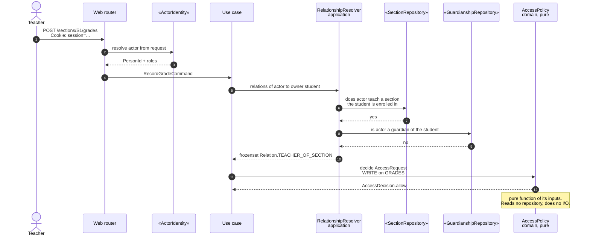
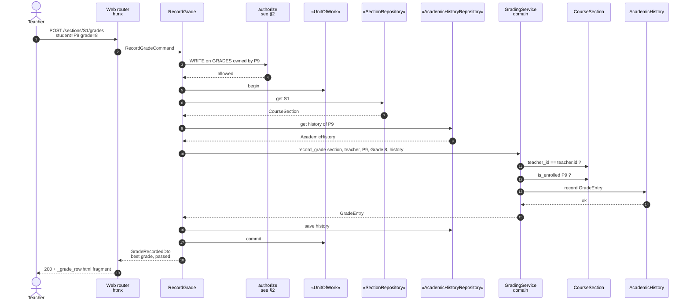
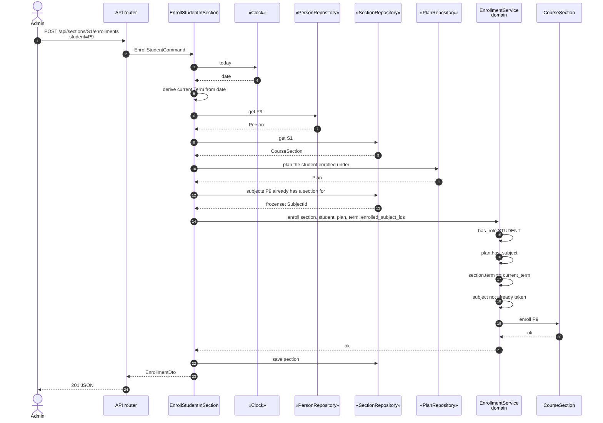
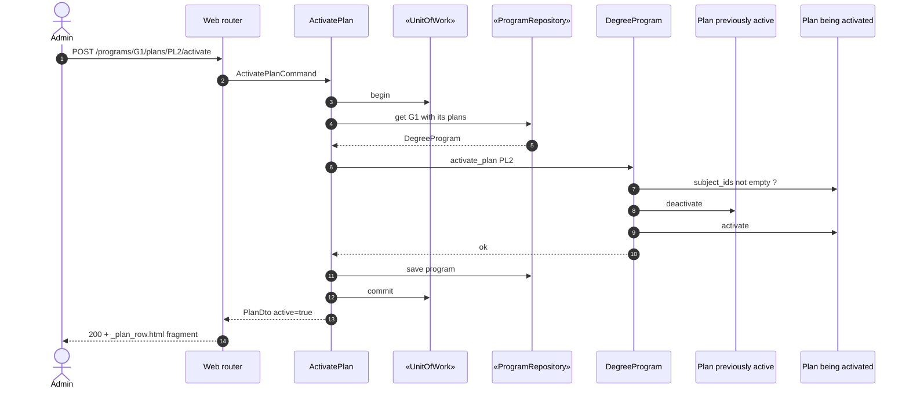
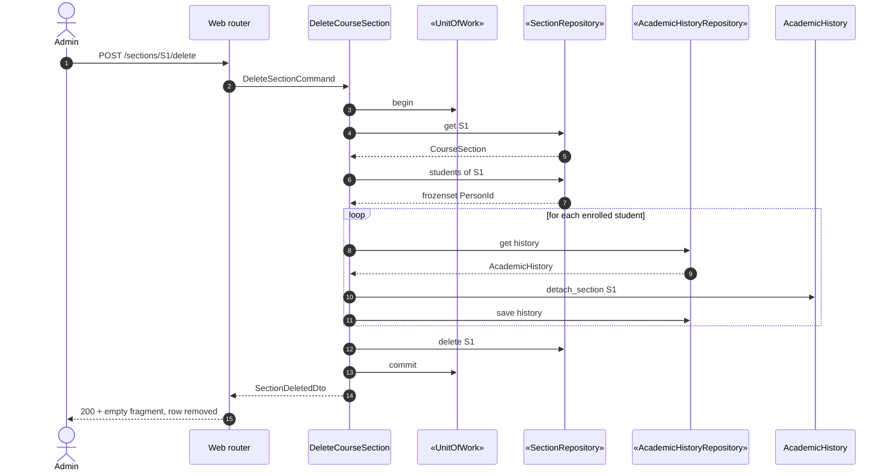
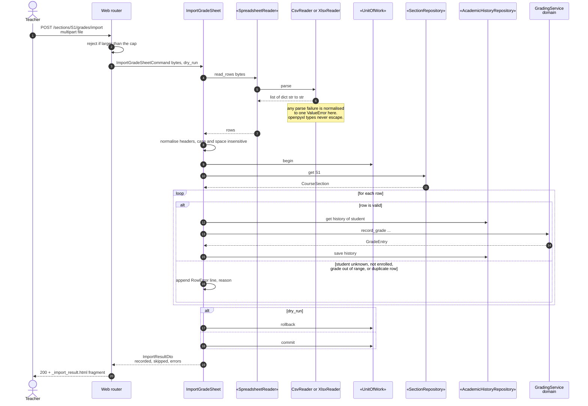
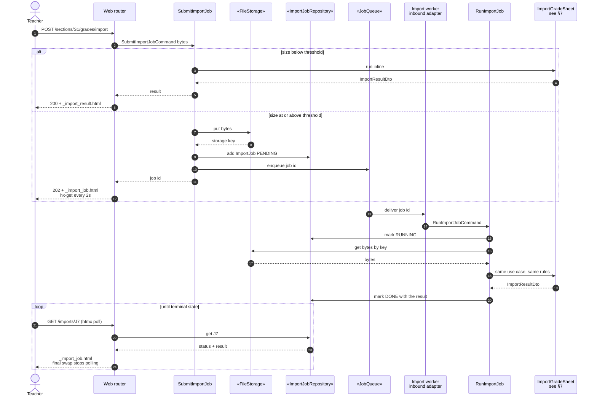
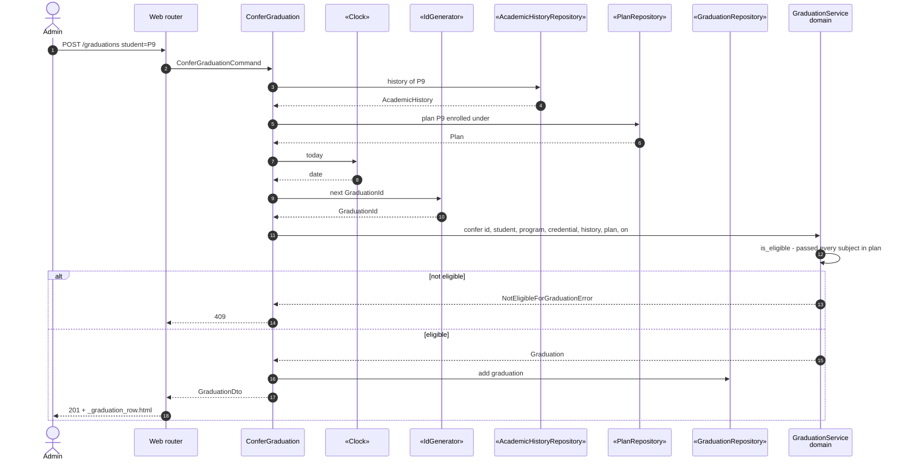
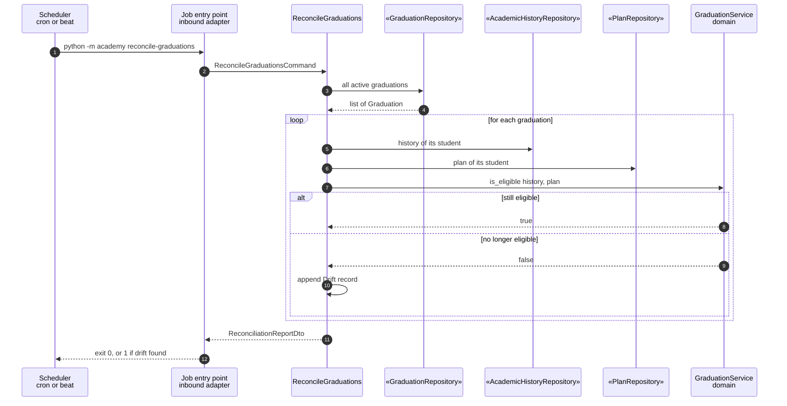

# Sequence diagrams

One diagram per significant use case from [`02-actors-and-use-cases.md`](./02-actors-and-use-cases.md).
These are the bridge between *what* the system does and *which object does it*: reading a
diagram top to bottom tells you which collaborator holds which responsibility, and the
[class diagram](./06-class-diagram.md) is the result of assigning those responsibilities. The
[state diagrams](./04-state-diagrams.md) cover the lifecycles these sequences move objects through.

## How to read these

Every diagram uses the same five bands, left to right, and **each arrow that crosses a band
boundary crosses a layer of the hexagon**:

| Band | What lives there | Depends on |
|------|------------------|------------|
| **actor** | a human, the scheduler, the import worker | — |
| **inbound adapter** | FastAPI web router, JSON API router, CLI command | application |
| **application** | the use case object, the `RelationshipResolver` | domain, ports |
| **domain** | entities, value objects, domain services, `AccessPolicy` | nothing |
| **port → adapter** | a `Protocol` in `application/ports/outbound/`, satisfied at runtime by an adapter | — |

Participants named `«port»` are interfaces the application owns. What sits behind them is
decided in `config/` and is *invisible* to every diagram below — which is the whole point:
none of these sequences changes when SQLite becomes PostgreSQL, or CSV becomes XLSX.

---

## 1. The shape of every request

Before the specific cases, the generic path. Every single use case in this system follows it.

```mermaid
sequenceDiagram
    autonumber
    actor Actor
    participant IA as Inbound adapter<br/>web / api / cli
    participant UC as Use case<br/>application
    participant DOM as Domain
    participant P as «port»<br/>outbound
    participant AD as Adapter<br/>sqlalchemy / csv / s3

    Actor->>IA: request in the adapter's own idiom<br/>form post, JSON body, argv
    IA->>IA: translate to a command DTO
    IA->>UC: execute command
    UC->>P: load what the rules need
    P->>AD: dynamic dispatch
    AD-->>P: domain objects
    P-->>UC: domain objects
    UC->>DOM: apply the rules
    DOM-->>UC: outcome or DomainError
    UC->>P: persist, commit
    UC-->>IA: result DTO
    IA-->>Actor: HTML fragment, JSON, or exit code
```

Two invariants hold in every diagram that follows:

- **the use case never talks to an adapter**, only to a port;
- **the domain never appears to the right of a port** — it neither loads nor saves itself.

---

## 2. UC-44 / UC-45 — Authenticating and authorizing

Drawn once, in full. Later diagrams collapse it to a single `authorize` arrow.



The split is the design point. **Resolving** which relationships hold is I/O, so it lives in
the application (`RelationshipResolver`). **Deciding** what those relationships grant is a
rule, so it lives in the domain (`AccessPolicy`) and stays a pure function — which is what
makes the whole grant matrix unit-testable with no database.

---

## 3. UC-22 — Record a grade

The only write path to a grade in the system.



Note what the use case does **not** do: it does not check that the teacher teaches the
section, nor that the student is enrolled. Those are invariants spanning two aggregates, so
`GradingService` owns them. The use case only orchestrates — load, delegate, save, commit.

`Grade(11)` never reaches this diagram at all: the value object rejects it in its
`__post_init__`, at the adapter's parsing boundary.

---

## 4. UC-18 — Enroll a student in a course section



The `Clock` is a port here for a reason: "the current term" is derived from today's date, so
without it this use case could only be tested by waiting for the calendar. With it, a test
pins `today` and asserts the `WrongTermError` deterministically.

---

## 5. UC-08 — Activate a plan



`DegreeProgram` — not the use case — flips both plans, because "exactly one active plan per
program" is an invariant of that aggregate. Putting the two calls in the use case would let
any future caller forget one and break the invariant.

Students already enrolled are untouched: grandfathering is achieved by *not* writing to
enrollments here at all.

---

## 6. UC-16 — Delete a course section

The one deletion that is allowed to have dependents, because it preserves them first.



The grades are not moved anywhere — they already live in `AcademicHistory`. All that happens
is `detach_section`, which nulls the originating-section reference so the transcript outlives
the section. Modelling it that way is why this use case is a loop and a delete rather than a
migration.

The single `commit` at the end matters: if the loop fails halfway, no history is left
half-detached and no section is deleted.

---

## 7. UC-40 — Import a grade sheet, inline path

The flagship. Note how little of it is about files.



Everything that makes this use case worth writing — header normalisation, per-row validation,
partial success, duplicate detection, dry-run — happens **above** the `SpreadsheetReader`
port. The adapter's entire job is `bytes → list[dict[str, str]]`.

That is what lets `tests/acceptance/features/grade_import.feature` run the identical
scenarios against the CSV adapter and the XLSX adapter and assert identical outcomes. If a
rule had leaked into the adapter, the two runs would diverge and the suite would say so.

---

## 8. UC-41 / UC-42 — Import, queued path

Same use case, different place to run it.



The branch is about *where* the work runs, never about *what* it does — both arms call the
same `ImportGradeSheet` object. Choosing `JobQueue`'s inline adapter in tests collapses the
whole right-hand side, so the queued path is testable without a broker.

---

## 9. UC-32 — Confer graduation



Both the date and the identifier arrive through ports. That is what makes a graduation
record assertable in a test: `FixedClock(date(2026, 3, 1))` and a deterministic id generator
turn an otherwise unrepeatable event into an exact expected value.

---

## 10. UC-35 — Scheduled reconciliation

The third driving adapter. Same use cases, no human.



Nothing here is new. The scheduler is simply a third way in, next to the browser and the JSON
API, and it reaches the identical objects — which is the practical payoff of having drawn the
boundary in §1.

---

## 11. What these diagrams decided

Reading them together, the responsibilities fall out, and they are the input to the
[class diagram](./06-class-diagram.md):

| Responsibility | Assigned to | Why (GRASP) |
|---|---|---|
| Enforce a rule inside one aggregate | the entity — `CourseSection.enroll`, `Grade.__post_init__` | *Information Expert*: it holds the data the rule reads |
| Enforce a rule spanning aggregates | a domain service — `EnrollmentService`, `GradingService` | no single entity owns the whole rule |
| Keep "one active plan per program" | `DegreeProgram` | *Information Expert* over its plans |
| Decide what a relationship grants | `AccessPolicy` | pure rule, so it belongs in the domain |
| Discover which relationships hold | `RelationshipResolver` | needs I/O, so it cannot be in the domain |
| Load, delegate, save, commit | the use case | *Controller* for a system operation |
| Translate HTTP or argv into a command | the inbound adapter | *Pure Fabrication*, keeps protocol out of the core |
| Turn bytes into rows, rows into bytes | the outbound adapter | *Indirection* behind the spreadsheet ports |
| Choose which adapter is used | `config/` composition root | the only place allowed to know both sides |
