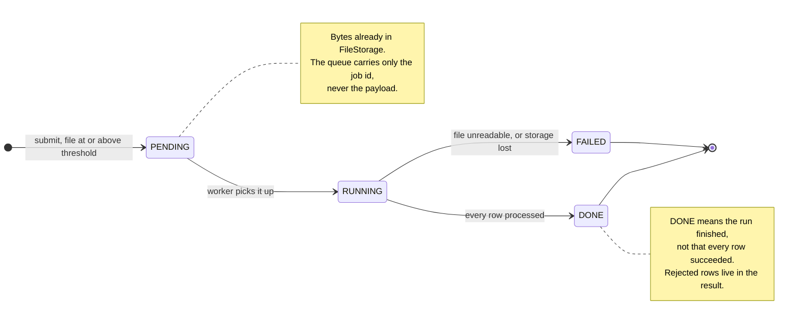
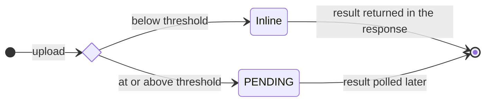
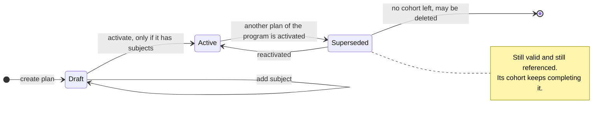
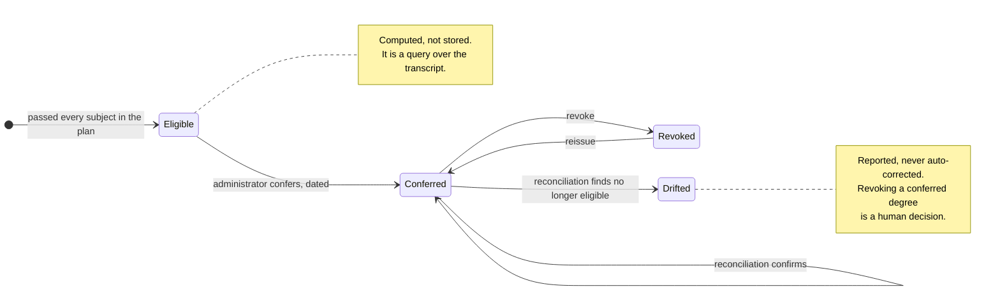
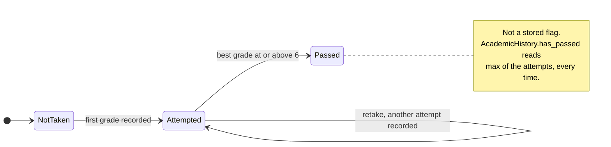
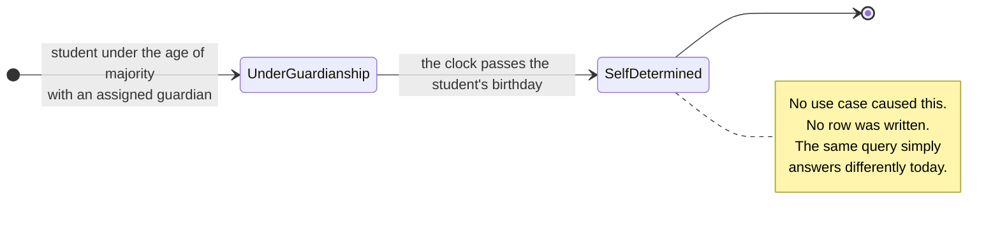
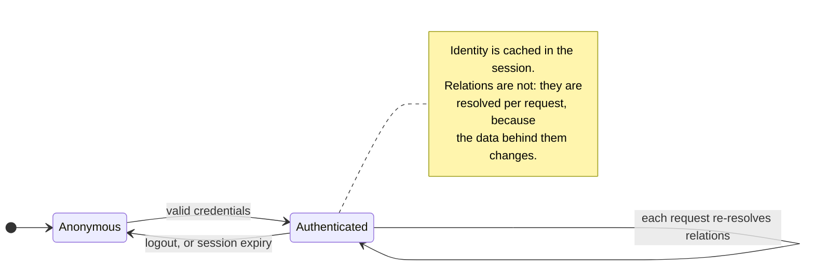

# State diagrams

The lifecycles implied by the [use cases](./02-actors-and-use-cases.md) and the
[sequence diagrams](./03-sequence-diagrams.md). A sequence diagram shows one run through the
system; a state diagram shows every run an object can have over its whole life.

They matter here for one specific reason: **a state machine tells you what must be stored and
what can be computed.** Get that wrong and you either persist something that can go stale, or
recompute something that needed to be a matter of record. Two of the diagrams below are the
result of deliberately choosing opposite answers.

## 1. Stored versus computed state — the summary

| Concept | Stored or computed | Why |
|---------|--------------------|-----|
| Import job status | **stored** | a second process advances it; it must survive a restart |
| Plan activation | **stored** | an administrative act with an intent that outlives the data |
| Graduation | **stored** | a dated, auditable conferral that supports revocation |
| Course section existence | **stored** | it owns enrollments |
| Subject pass/fail | **computed** | derived from the best grade; cannot go stale |
| Guardianship | **computed** | derived from age against the global age of majority |

The two computed rows are the interesting ones, and §5 and §6 explain what that costs and
buys.

## 2. ImportJob — the only state machine the application owns

Two subtleties worth stating, because both are easy to get wrong:

**`DONE` is not `ok`.** A run that rejected 30 of 100 rows is `DONE` — it completed. Whether
the outcome was acceptable is `ImportResultDto.ok()`, a separate question. Collapsing the two
would make a partially-rejected import indistinguishable from an unreadable file.

**The inline path has no states at all.** Below the size threshold the import runs
synchronously and never becomes an `ImportJob`. That is why the diagram starts with a
guarded transition rather than at submission: the state machine exists only to coordinate two
processes, so when there is only one process, there is nothing to coordinate.

## 3. Plan — activation within a degree program

The state that carries the design decision is **`Superseded`, not `Deleted`**. Replacing a
plan grandfathers the students already enrolled under it, so the old plan has to remain
readable and enforceable for years after it stops being offered.

`Draft --> Active` is guarded on the plan having at least one subject. An empty plan is
vacuously completed, which would make every enrolled student an instant graduation candidate
— the guard is why `GraduationService.is_eligible` can raise `EmptyPlanError` and know it is
a genuine data fault rather than a normal case.

## 4. Graduation — a stored, revocable conferral

This diagram is where "stored versus computed" gets interesting, because the answer is
**both**. `Eligible` is computed on demand from the transcript. `Conferred` is stored, because
a graduation needs a date, an issued credential, and an audit trail — none of which a
computation can invent.

Storing it creates the possibility of drift: the record says conferred, the transcript no
longer agrees. UC-35 reconciles the two on a schedule and **reports**, never corrects.
Auto-revoking someone's degree because a grade was edited is not a decision software should
take by itself.

## 5. Subject standing — computed, never stored

There is no `Failed` state, and that is deliberate: a student who has not passed is simply
still `Attempted`, and a further retake can change the answer. Modelling failure as a state
would require somebody to decide when it becomes permanent, which the domain never does.

Because standing is recomputed from the attempts, **it cannot go stale.** Recording a retake
requires no cascade — no flag to flip on the enrollment, no counter to bump on the plan, no
"recalculate standing" job. `record()` appends, and every reader derives.

The cost is real and worth naming: `has_passed` scans the transcript on every call. At
academy's scale that is nothing. At a scale where it mattered, the fix is a cached projection
in the *adapter* — the domain rule would not change.

## 6. Guardianship — a state that time changes without anyone acting

The sharpest case in the model, and the reason `Clock` is a port.

Every other transition in this document is caused by an actor invoking a use case. This one is
caused by **nothing happening**. The student comes of age, and guardian access stops
resolving — with no scheduled job, no birthday trigger, and no stored transition to keep in
sync.

That is only implementable because the rule is evaluated on read, against a `today` supplied
from outside:

- the domain takes `today: date` as an argument and stays deterministic;
- the application supplies it from the `Clock` port;
- a test injects `FixedClock(date(2026, 3, 2))` and asserts that guardian access which worked
  the day before is now denied.

Had the domain called `date.today()` itself, this transition would be untestable except by
changing the system clock. That single consideration is the clearest justification in the
whole codebase for treating time as a port rather than a built-in.

## 7. Actor session

The self-transition is the point. **Who you are** is established once per session; **what you
may touch** is recomputed on every request. Caching relations in the session would mean a
teacher removed from a section at 10:00 could still write grades until their cookie expired.

## 8. What these diagrams contribute to the design

| Diagram | Consequence for the code |
|---------|--------------------------|
| ImportJob | `ImportJobRepository` and `JobQueue` ports exist; the payload goes to `FileStorage`, not through the queue |
| Plan | `DegreeProgram` owns activation, so the "exactly one active" invariant has a single enforcement point |
| Graduation | reconciliation is a use case with a **report**, not a corrective write |
| Subject standing | no denormalised pass flag anywhere, so no cache-invalidation logic anywhere |
| Guardianship | `Clock` is an outbound port, and the domain accepts `today` as a parameter |
| Session | authentication is adapter-level; authorization is per request, in `AccessGuard` |

Next: [the class diagram](./06-class-diagram.md), where these responsibilities become classes.
