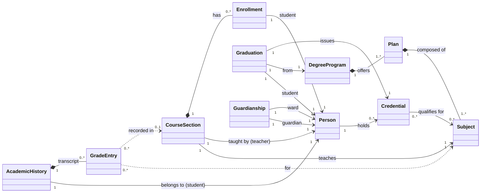
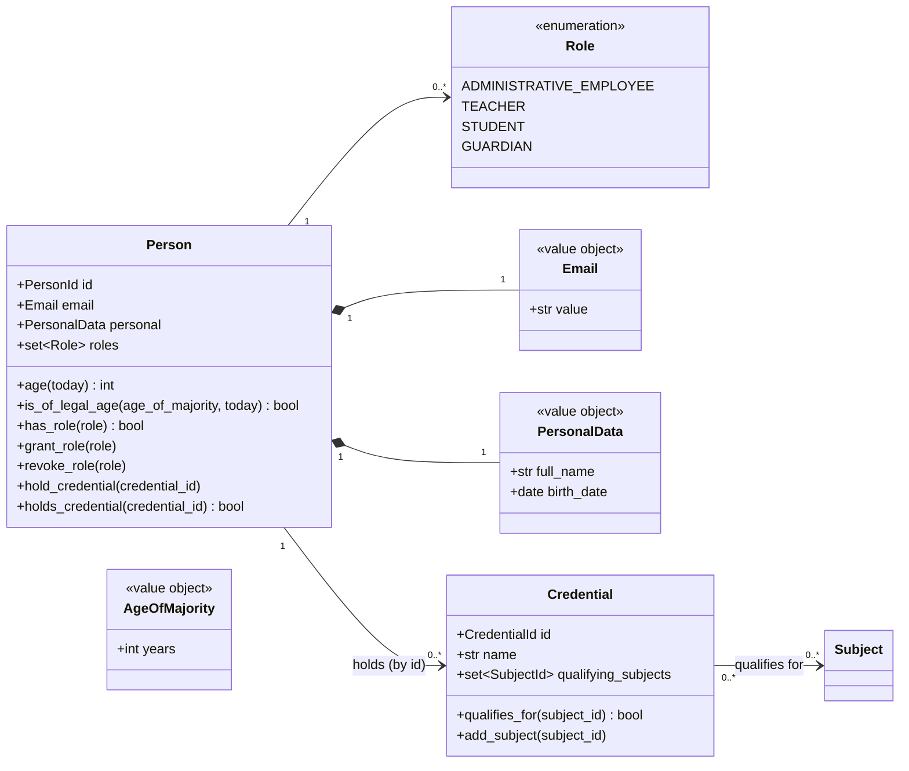
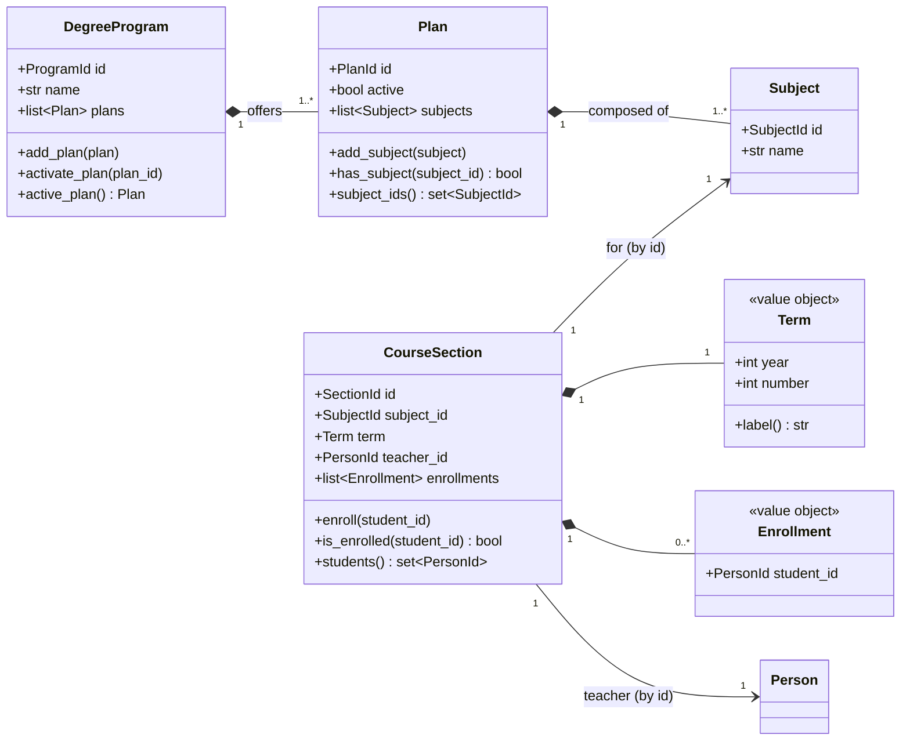
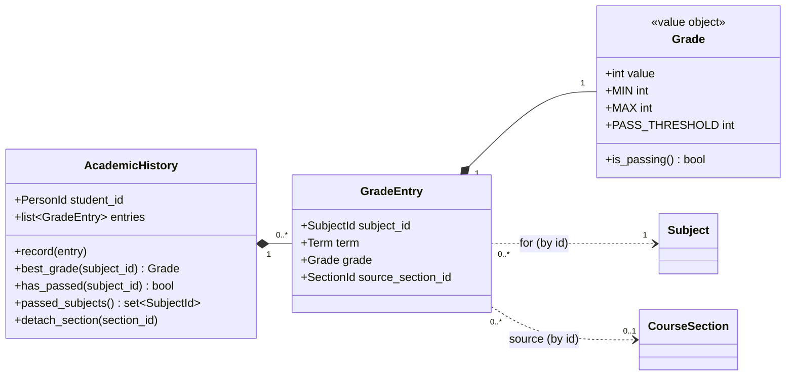
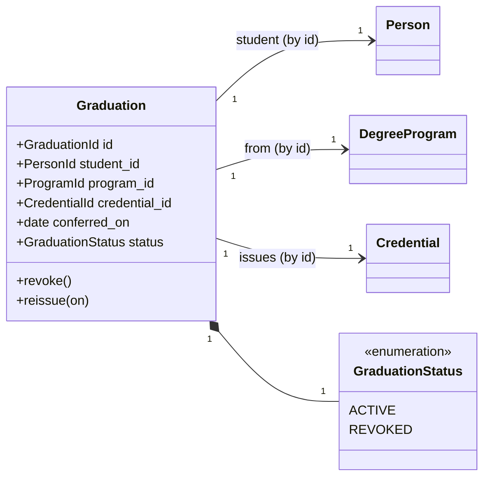
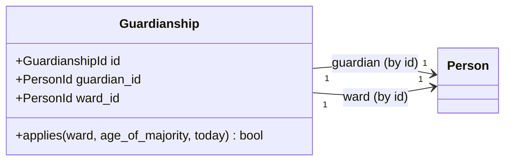
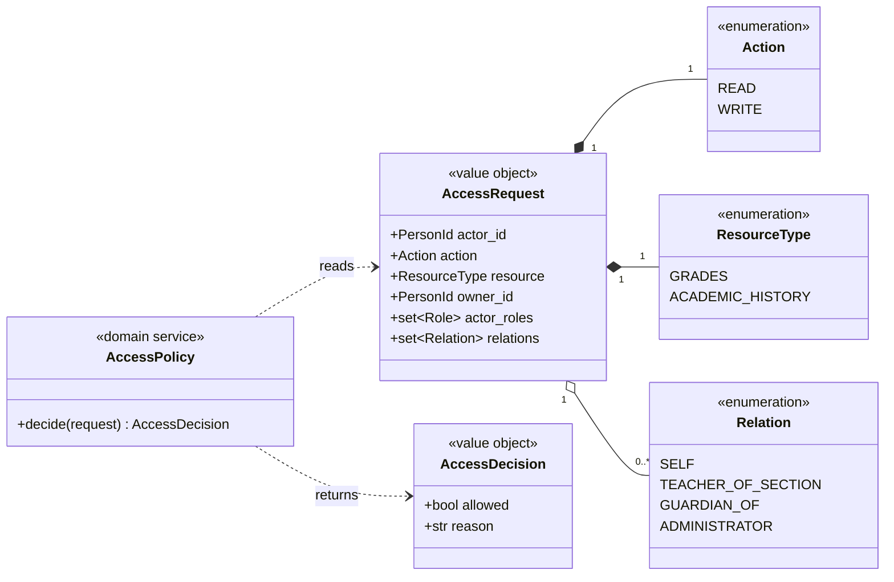

# Domain model

Object-oriented model of the academic records system described in
[`01-description.md`](./01-description.md). This document is the design reference for the
domain layer under `src/academy/domain/`.

The system follows **ports and adapters (hexagonal) architecture**. This first iteration
implements **only the domain** -- pure business objects with no database, no framework,
and no I/O. Persistence and other I/O arrive later as adapters behind ports; this document
notes where those seams are but does not implement them.

**Authorization is self-served.** Every access decision is made in-process by our own
pure domain policy against relationships resolved from the system's own repositories.
There is no external authorization service and no dependency on any third-party policy
engine.

## Design conventions

- **Entities** have identity (a UUID) and a lifecycle. **Value objects** are immutable,
  compared by value, and have no identity.
- **Aggregate roots** own their invariants; cross-aggregate references are by id
  (`PersonId`, `SubjectId`, ...), never by object pointer.
- The domain is **pure**: no clock, no randomness, no I/O. Any rule that depends on "now"
  (age, guardianship) takes an explicit `today: date` argument, so decisions are
  deterministic and testable.
- Rules that need data from more than one aggregate live in a **domain service**
  (e.g. enrollment validation, teacher qualification, graduation eligibility).

## Aggregate overview



Aggregate roots (each is a consistency boundary): **Person**, **Credential**,
**DegreeProgram** (containing Plans and Subjects), **CourseSection** (containing
Enrollments), **AcademicHistory** (containing GradeEntries), **Graduation**,
**Guardianship**.

## People, roles, and credentials

A single `Person` record carries every role that person plays. Roles are a set of the
`Role` enum (this is the candidate "RoleAssignment" collapsed onto the person, since
person = tenant and roles are held globally by the person). Relationships that grant
access to *other* people's records -- teaching, guardianship, enrollment -- are modelled
as their own objects, not as roles.



- `Email` is unique across persons (a system-wide invariant enforced at the repository
  boundary, not inside the aggregate).
- `AgeOfMajority` is a **single global value**. `Person.is_of_legal_age` and guardianship
  take it as an argument rather than reading a global -- keeping the domain pure.
- A `Credential` is the "titulo": it both **qualifies a teacher** to teach its associated
  subjects and is the thing a `DegreeProgram` **issues on graduation**. A graduate's
  credential can therefore later qualify them as a teacher.

## Academic structure



Invariants and rules:

- **`DegreeProgram`: at most one active plan.** `activate_plan(plan_id)` activates the
  target and deactivates every other plan in the program. Enforced inside the aggregate.
- **`Plan` is a flat set of subjects** -- no prerequisites. Any subject may be taken in
  any term.
- **`Term`** is `(year, number in {1, 2})`; `label()` renders `2026-T1`. Two four-month
  terms per year.
- **Teacher qualification (hard-enforced).** A `CourseSection` may only be created / have
  a teacher assigned when the teacher holds a `Credential` that `qualifies_for` the
  section's subject. This spans Person + Credential + Subject, so it is checked by a
  **`CourseSectionFactory` / assignment domain service**, not inside the aggregate.
- **Enrollment rule.** `enroll` requires: the subject is in the student's plan, the
  section is offered in the current term, and the student is not already enrolled in a
  section of that subject. The plan-membership check spans aggregates, so an
  **`EnrollmentService`** validates it before calling `CourseSection.enroll`.

## Grades and academic history

Grades are recorded into the student's **`AcademicHistory`**, the durable transcript.
A `CourseSection` is transient: deleting it only detaches the originating-section
reference on the affected entries (`detach_section`), the grades themselves survive.



- **`Grade`** is an integer `0..10`; `PASS_THRESHOLD = 6`; `is_passing()` is
  `value >= 6`. Construction rejects out-of-range values.
- **All attempts are kept.** `best_grade(subject_id)` returns the highest grade for a
  subject; `has_passed` is `best_grade >= 6`. Retakes add entries, never overwrite.
- **Recording a grade** (teacher action) creates a `GradeEntry` and appends it via
  `AcademicHistory.record`. Coordinating "student is enrolled in the teacher's section"
  with "append to that student's history" is a **`GradingService`** responsibility.
- **`source_section_id`** is nullable so `detach_section` can null it when a section is
  deleted, without losing the grade.

## Graduation



- Graduation is a **stored conferral event**: a dated record that issues a credential and
  can be revoked / reissued.
- **Eligibility** ("passed every subject in the plan the student enrolled under") is a
  computed check performed by a **`GraduationService`** against the student's
  `AcademicHistory` and their `Plan`. Conferral is a deliberate act by an administrative
  employee; a reconciliation routine (later, application layer) compares stored
  graduations against computed eligibility so they do not drift.

## Guardianship and age of majority



- A `Guardianship` links a guardian to a ward. The **assignment is stored**, but whether
  it **applies** is **computed on read**: `applies(...)` returns true only while the ward
  is a minor (`not ward.is_of_legal_age(age_of_majority, today)`). Once the ward reaches
  the age of majority, guardian access stops resolving -- no stored transition, no job.
- A guardian and the guardian's ward must both be actual `Person` records; the guardian
  must be of legal age. A student of legal age exercises the guardian powers over
  themselves (handled by the *self* relation in authorization, below).

## Authorization model (self-served)

Authorization is **relationship-based (ReBAC)** because each person is a tenant and almost
every access crosses persons. It is **self-served**: `AccessPolicy` is a **pure domain
service** that decides `allow` / `deny` from its inputs alone. Which relationships hold
between the actor and the record's owner is resolved from the system's **own repositories**
by an application-layer `RelationshipResolver`, which then feeds the policy. No external
service, no network call, no third-party engine.

The design reuses standard authorization *concepts* -- a single **Policy Decision Point**
(every access check funnels through `AccessPolicy`, our own `check`-style entry point),
plus **resources**, **actions**, and **relations** -- and reimplements them in-house,
sized to this domain. Centralizing the decision keeps the rule in one auditable place
instead of scattering `if role == ...` checks across the API handlers.

**Resources and actions**

| Resource | Actions |
|----------|---------|
| `grades` | `read`, `write` |
| `academic_history` | `read`, `write` |

**Roles** (held on `Person`): `administrative_employee`, `teacher`, `student`,
`guardian`.

**Relations** (the edges the policy walks): `self`, `teacher_of_section`, `guardian_of`,
`administrator`.

**Grant matrix** -- the complete relation x (resource, action) permission table. A request
is allowed if any of its resolved relations grants the requested `(resource, action)`:

| Relation           | grades.read | grades.write | history.read | history.write |
|--------------------|:-----------:|:------------:|:------------:|:-------------:|
| self               |      ✓      |      ✗       |      ✓       |       ✗       |
| teacher_of_section |      ✓      |      ✓       |      ✗       |       ✗       |
| guardian_of        |      ✓      |      ✗       |      ✓       |       ✗       |
| administrator      |      ✓      |      ✗       |      ✓       |       ✗       |
| (none)             |      ✗      |      ✗       |      ✗       |       ✗       |

The grants are **record-level**: each ✓ applies only to the subset of records the relation
scopes to --

- **self** -- the person's own grades and history.
- **teacher_of_section** -- only students enrolled in a section the teacher teaches, and
  only for that section's subject.
- **guardian_of** -- the wards' records, and only while the ward is a minor (guardianship
  is computed on read).
- **administrator** -- grade listings, academic histories, and graduation lists; read-only,
  never writes grades.

This matrix is asserted end-to-end by the acceptance features
`tests/acceptance/features/grades_permissions.feature` and
`academic_history_permissions.feature`.



- `AccessPolicy.decide` is a **pure function of its inputs** (actor roles + resolved
  relations + action + resource). It applies the grant matrix and returns an
  `AccessDecision`. Being pure, it is trivially unit-testable and has no I/O.
- `AccessRequest` carries the actor, the action, the resource type, the record owner
  (`owner_id`), the actor's roles, and the **already-resolved** set of `relations` that
  hold between actor and owner. Resolving those relations (is the actor the owner? does the
  actor teach a section this student is enrolled in? is the actor the ward's guardian and
  the ward still a minor? is the actor an administrator?) is the **self-served** step,
  performed by the application layer against the repositories -- see
  `RelationshipResolver` in the application layer (next iteration).

## Value objects and enums (summary)

| Name | Kind | Notes |
|------|------|-------|
| `Email` | value object | validated, unique system-wide |
| `PersonalData` | value object | `full_name`, `birth_date` |
| `Term` | value object | `(year, number in {1,2})`, `label()` -> `2026-T1` |
| `Grade` | value object | int `0..10`, `PASS_THRESHOLD = 6` |
| `AgeOfMajority` | value object | single global value |
| `Enrollment` | value object | `student_id` inside a `CourseSection` |
| `GradeEntry` | entity (in AcademicHistory) | `(subject, term, grade, source_section?)` |
| `Role`, `GraduationStatus`, `Action`, `ResourceType`, `Relation` | enumerations | |
| `PersonId`, `CredentialId`, `ProgramId`, `PlanId`, `SubjectId`, `SectionId`, `GraduationId`, `GuardianshipId` | value objects | typed UUID wrappers |

## Domain services (multi-aggregate rules)

| Service | Responsibility |
|---------|----------------|
| `CourseSectionFactory` | create a section only if the teacher holds a credential qualifying for the subject (hard-enforced qualification) |
| `EnrollmentService` | validate the enrollment rule (plan membership, term, no duplicate) before `CourseSection.enroll` |
| `GradingService` | record a grade into the enrolled student's `AcademicHistory` |
| `GraduationService` | compute eligibility (all plan subjects passed) and confer a `Graduation` |
| `AccessPolicy` | pure self-served authorization: apply the grant matrix to a resolved `AccessRequest` |

## Directory structure

Single installable package `src/academy/`, split into the three hexagonal layers
**domain -> application -> adapters**, with the domain further split **by bounded
context** (people, academics, grades, ...). The layout borrows deliberately from two
in-house references:

- from **iqueue**: hard layer separation (domain / application / adapters), **ports split
  into `input` and `output`**, one file per entity / value object, typed-UUID id value
  objects, an **in-memory persistence adapter**, and an **import-linter contract** that
  makes the dependency rule a CI-blocking check;
- from **bluedoter-tng**: a single `src/<package>/` tree, **package-by-bounded-context**
  inside `domain/` and `application/`, adapters split `inbound` / `outbound`, a `shared/`
  domain package for ids/base types/errors, and a `config/` composition root.

Application shape: a **Python + FastAPI backend** exposing a JSON API; clients (curl or
simple Python scripts) call that API. So the only inbound adapter is `api`; there is no
server-rendered web UI.

**This iteration creates only `domain/`** (fully). The other layers are shown to fix the
target shape; they are added in later iterations without touching the domain.

```
src/academy/
  domain/                     # THIS iteration -- pure, no I/O, no framework
    shared/                   # PersonId, SubjectId, ... typed ids; base errors
    people/                   # Person, Email, PersonalData, Role, Credential, AgeOfMajority
    academics/                # DegreeProgram, Plan, Subject, Term, CourseSection, Enrollment
    grades/                   # Grade, GradeEntry, AcademicHistory
    guardianship/             # Guardianship
    graduation/               # Graduation, GraduationStatus
    authorization/            # Action, ResourceType, Relation, AccessRequest, AccessDecision, AccessPolicy
    services/                 # CourseSectionFactory, EnrollmentService, GradingService, GraduationService

  application/                # later -- use cases orchestrating the domain
    ports/
      input/                  # use-case interfaces (driving ports)
      output/                 # repository + Clock + IdGenerator interfaces (driven ports)
    use_cases/                # one class per use case
    dto/                      # request/response data crossing the boundary
    authorization/            # RelationshipResolver (self-served: reads repos, feeds AccessPolicy)

  adapters/                   # later
    inbound/
      api/                    # FastAPI app, routers, schemas, dependency wiring
    outbound/
      persistence/
        sqlalchemy/
          orm/                # SQLAlchemy table/model definitions
          mappers/            # domain aggregate <-> ORM row translation
          repositories/       # output-port implementations backed by a SQLAlchemy Session

  config/                     # composition root: build engine + session, use cases, inject adapters

alembic/                      # schema migrations (alembic.ini at repo root)
  versions/

tests/                        # mirrors the scaffold: unit / integration / acceptance / e2e
```

**Persistence: SQLAlchemy + Alembic on in-memory SQLite.**
- The database is **in-memory SQLite**. To keep a single in-memory database alive across
  connections (so migrations and the app share it), the engine uses SQLAlchemy's
  `StaticPool` with `check_same_thread=False` on a `sqlite://` URL -- otherwise each
  connection would get its own throwaway database.
- **Alembic drives the schema**: migrations under `alembic/versions/` are applied to the
  in-memory engine at startup (and per-session in tests), rather than
  `Base.metadata.create_all()`, so the schema history is the single source of truth even
  for the ephemeral DB.
- The ORM lives **only** in this adapter, using SQLAlchemy **imperative (classical)
  mapping**: domain aggregates are plain classes that never inherit from a declarative
  `Base` or import SQLAlchemy. Tables are defined separately in `orm/` and wired to the
  domain classes with `registry.map_imperatively()` in `mappers/`, so the domain stays
  persistence-ignorant. This is the classic "separate the domain model from the data
  model" seam. See [ADR-0006](./decisions/0006-sqlalchemy-imperative-mapping.md).
- These repositories are what makes authorization **self-served**: the
  `RelationshipResolver` reads relationships (enrollment, teaching, guardianship) through
  these same repositories to feed `AccessPolicy`.

New runtime dependencies land when this adapter is built (not in the domain-only
iteration): `sqlalchemy`, `alembic`, and FastAPI's stack (`fastapi`, `uvicorn`).

**Dependency rule (enforced later with import-linter):**
`adapters -> application -> domain`. The domain imports nothing from the outer layers;
the application depends only on the domain and its own ports; adapters implement the ports.
`config` is the only place allowed to know every layer.
