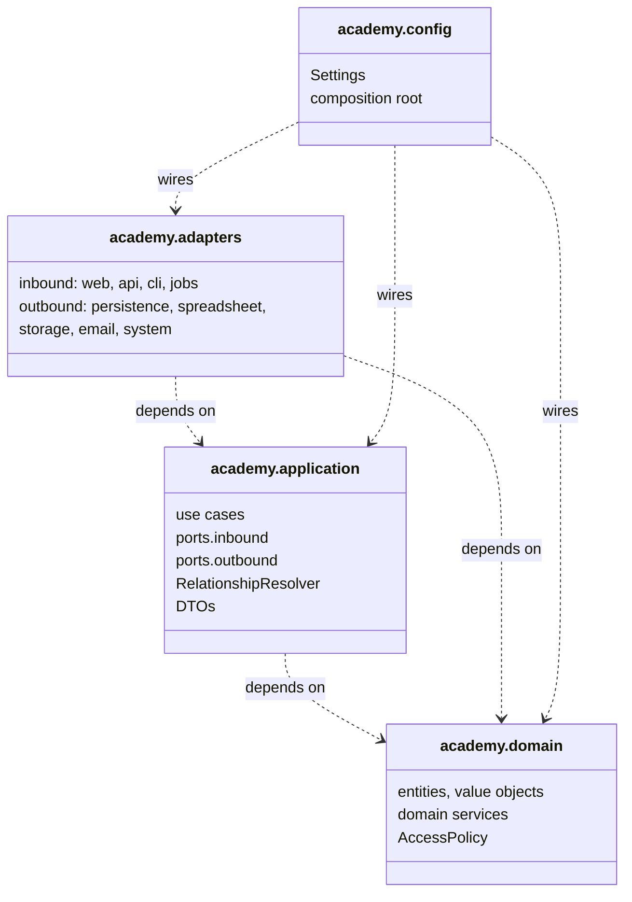
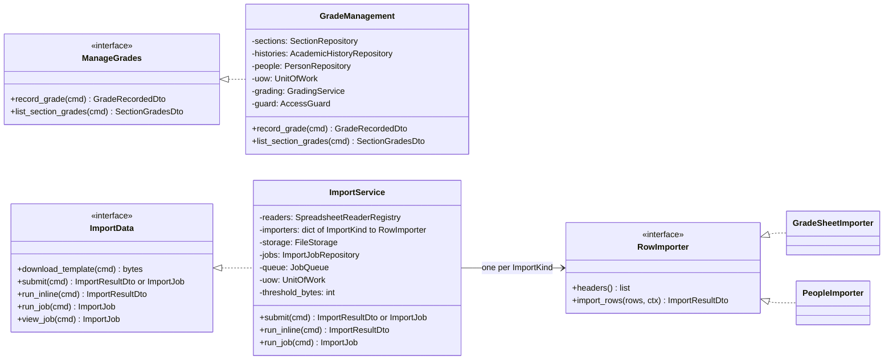
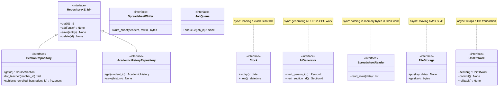
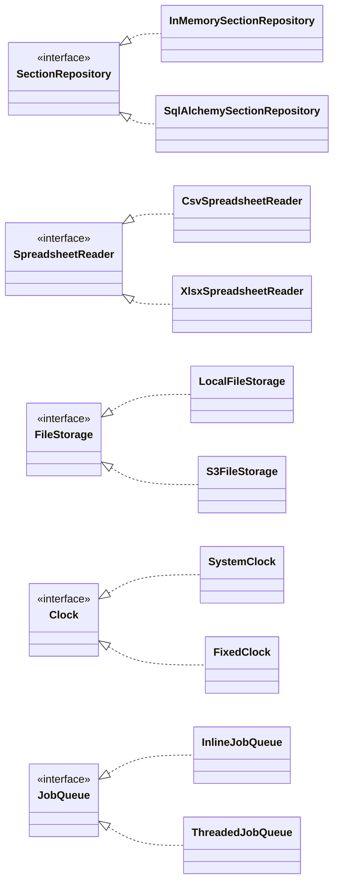
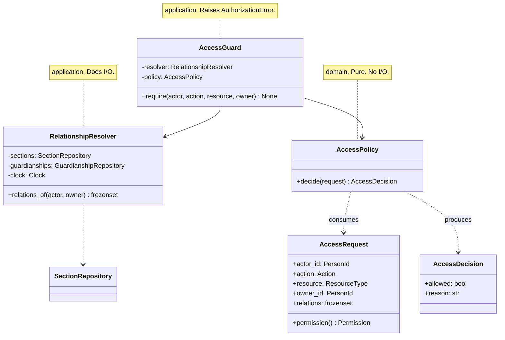
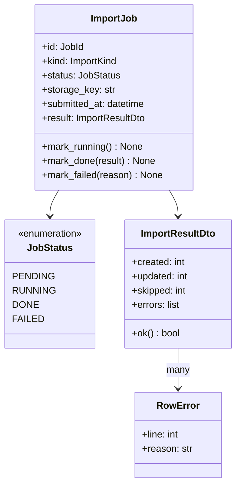

# Class diagram

The static structure that results from assigning the responsibilities identified in
[`03-sequence-diagrams.md`](./03-sequence-diagrams.md). The **domain** model is already specified in
[`05-domain-model.md`](./05-domain-model.md); this document covers the layers built around it — the application
layer, the ports, and the adapters that satisfy them.

Read it as the answer to one question: *given the collaborations in the sequence diagrams,
what classes must exist, and which layer does each belong to?*

## 1. Layers and the dependency rule

Every arrow points inward, and `domain` has none leaving it. That is the whole architecture;
everything below is detail. The rule is machine-checked — see
[ADR-0004](./decisions/0004-enforce-the-dependency-rule.md) — so it cannot rot silently.

## 2. Driving ports and use cases

Each use case is a small class with one public method. It is a *Controller* in GRASP terms:
it receives a command, orchestrates, and returns a DTO. It holds no rules of its own.

**One implementation class per port, not per use case.** A port is an interface, so the class
that satisfies it must carry all of its methods; splitting `ManageGrades` across a `RecordGrade`
class and a `ListSectionGrades` class would mean neither implements it. The use cases survive
as *methods*, each still a Controller in the GRASP sense: load, delegate, save, commit.

Where a use case is genuinely large, it delegates to a collaborator rather than growing --
`ImportService` owns the inline-or-queued decision and the transaction, and hands the actual
row rules to a `RowImporter` chosen by `ImportKind`. That is what keeps ADR-0009's promise
structurally true: both paths reach the same importer, because there is only one.

The inbound ports are grouped by *actor intent*. A web router that renders the grading screen
depends on `ManageGrades` and therefore cannot reach `delete_section` even by accident.

## 3. Driven ports

The full outbound surface. **Async where crossing the port means waiting on something outside
the process; sync where it does not** — the rule from
[ADR-0005](./decisions/0005-async-io-ports-sync-cpu-ports.md).

`SectionRepository` shows the shape every repository port takes: the generic CRUD it inherits,
plus **query methods named after the questions the use cases actually ask**. There is no
`find_by(**criteria)` escape hatch, because one would let a use case push its logic down into
the adapter and quietly make the port un-swappable.

## 4. Adapters behind the ports

Each port has at least two implementations. That is not gold-plating — it is the proof that
the port is real. A port with one implementation has never been tested as an abstraction.

The in-memory repositories are not test doubles bolted on afterwards — they are first-class
adapters, and the same contract test suite runs against them and against SQLAlchemy. If the
two disagree, one of them is wrong, and the suite says which behaviour was specified.

## 5. Authorization

The one place worth showing in detail, because the split between the two classes is easy to
get wrong and expensive to undo.

`AccessPolicy` stays in the domain because the grant matrix is a business rule that a
regulator could ask to see. `RelationshipResolver` cannot join it there: answering "does this
teacher teach a section this student is enrolled in?" requires reading a repository, and the
domain does no I/O. `AccessGuard` is the thin *Pure Fabrication* that joins them so that no
use case ever repeats the resolve-then-decide dance.

## 6. Import model

`RowError` carrying a line number is what makes partial success usable: the teacher gets back
"rows 4, 17 and 31 were rejected, and why", not a single opaque failure. It is a DTO, not a
domain object, because it describes an *import run* rather than anything academic.

## 7. Traceability

Every class above traces to a use case, and every use case to an actor.

| Actor | Use cases | Driving port | Implementing class | Principal methods |
|-------|-----------|--------------|--------------------|-------------------|
| Administrative employee | UC-01..19, 31..34, 37..39, 43 | `ManageStructure`, `ManagePeople`, `ImportData` | `StructureManagement`, `PeopleManagement`, `ImportService` | `activate_plan`, `create_section`, `delete_section`, `confer_graduation` |
| Teacher | UC-20..24, 36, 40 | `ManageGrades`, `ImportData` | `GradeManagement`, `ImportService` | `record_grade`, `list_section_grades`, `run_inline` |
| Student | UC-25..27 | `ViewStudentRecords` | `StudentRecords` | `view_academic_history` |
| Guardian | UC-28..30 | `ViewStudentRecords` | `StudentRecords` | `list_my_wards`, `view_academic_history` |
| Scheduler | UC-35 | `MaintainRecords` | `RecordMaintenance` | `reconcile_graduations` |
| Import worker | UC-42 | `ImportData` | `ImportService` | `run_job` |

Student and Guardian share one port and one class: they ask the identical question, and differ
only in the relation that authorizes it. Two classes would mean two authorization checks, and
eventually two *different* authorization checks.

## 8. What deliberately has no class

Worth stating, because the absences are decisions:

- **No `AcademicService` / `AcademyManager` god object.** Responsibilities were assigned to
  the object holding the information, so they scattered — correctly — across entities, four
  domain services, and one small class per use case.
- **No ORM base class in the domain.** SQLAlchemy maps the domain classes *imperatively*, from
  the adapter side, so `Person` never learns it is persistable
  ([ADR-0006](./decisions/0006-sqlalchemy-imperative-mapping.md)).
- **No repository interface in the domain.** Repositories are how the *application* reaches
  storage. Putting them in the domain is a common variant, and it would put an I/O-shaped
  interface inside the layer defined by having no I/O.
- **No DTO in the domain.** DTOs describe what crosses a boundary; the domain has no boundary
  to cross.
